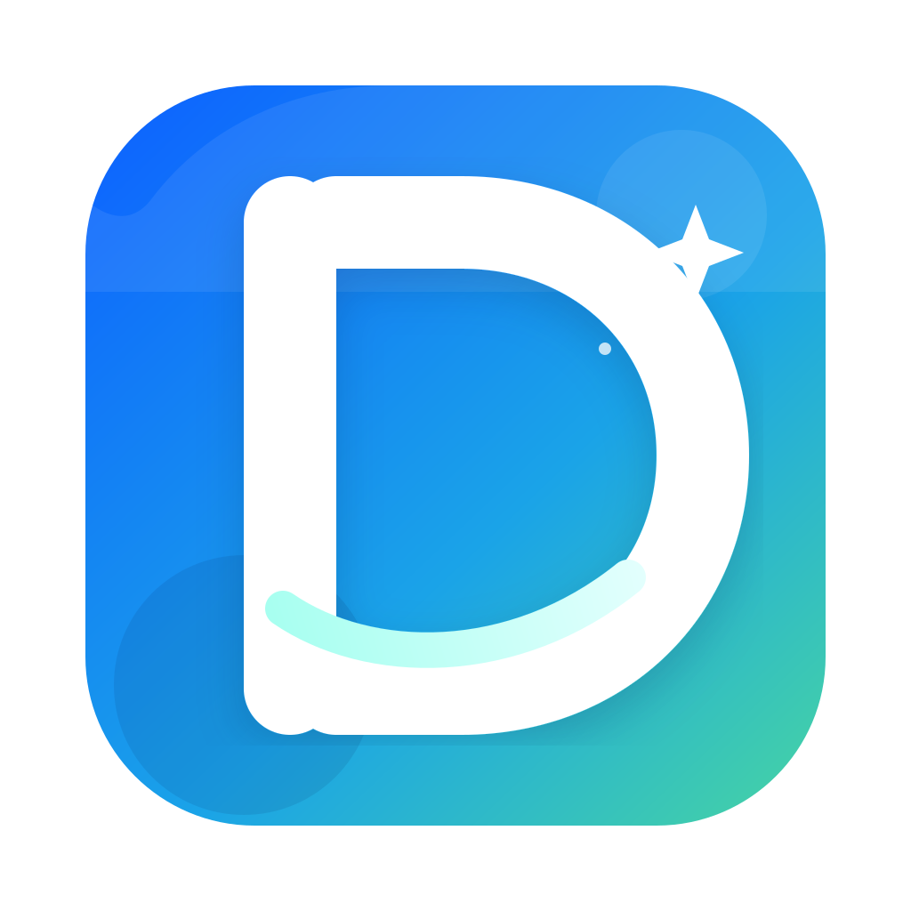

<p align="center">
  
</p>

<h1 align="center">DevClean</h1>

<p align="center">
  面向 macOS 开发者的本地磁盘清理与空间分析工具。
</p>

<p align="center">
  <strong>先扫描，再确认；了解每一项，再执行清理。</strong>
</p>

DevClean 帮助开发者找出 Xcode、模拟器、包管理器、Docker、AI 工具和应用缓存等常见空间占用来源。它同时提供 SwiftUI 桌面应用和命令行工具，扫描与删除逻辑共享同一套核心模块。

> 仓库和 CLI 目前仍使用 `MacCleaner` / `mac-cleaner` 作为内部名称；产品名称为 **DevClean**。

## 能做什么

- 扫描开发环境中常见的缓存、构建产物、日志、旧 SDK 与大文件。
- 在桌面端查看扫描结果、磁盘树、重复文件、应用残留、内存和进程信息。
- 在 CLI 中输出可脚本化的 JSON 扫描结果，或按模块、按预设方案清理。
- 对删除目标执行路径范围、受保护目录、符号链接和文件身份校验。
- 可选接入 DeepSeek，为已选项目或进程提供解释与风险建议；AI 不会自动选择、删除文件或结束进程。

## 扫描范围

| 模块 | 标识 | 典型内容 |
| --- | --- | --- |
| 开发者缓存 | `dev-caches` | Gradle、Maven、npm、Yarn、pnpm、Cargo、Go、pip、SwiftPM、Homebrew 等缓存 |
| iOS 模拟器 | `simulators` | CoreSimulator 运行时、设备数据和相关缓存 |
| Xcode | `xcode` | DerivedData、Archives、DeviceSupport |
| AI 工具缓存 | `ai-caches` | AI 编程助手和智能工具的本地缓存 |
| 应用缓存 | `app-caches` | `~/Library/Caches` 中的应用缓存 |
| Docker | `docker` | Docker Desktop 磁盘镜像与缓存候选 |
| 系统日志 | `system-logs` | 应用日志、诊断报告、崩溃日志 |
| Android SDK | `android-sdk` | 旧版 platforms、build-tools、NDK、system images 与 AVD |
| 大文件 | `large-files` | 主目录中大于 100 MB 的文件 |

桌面应用还提供应用卸载及残留扫描、重复文件查找、磁盘可视化、内存清理和活动监视器。扫描大文件时，扫描页会流式展示已发现的候选（Top 50），排名随扫描进展持续更新。

## 环境要求

- macOS 14 或更高版本
- Xcode 16.4 或兼容 Swift 5.9 的工具链
- 如需重新生成 Xcode 项目： [XcodeGen](https://github.com/yonaskolb/XcodeGen)

为了获得完整扫描结果，建议给桌面应用授予“完全磁盘访问”权限。没有该权限时，DevClean 会跳过或报告无权读取的目录；它不会绕过 macOS 的权限控制。

## 快速开始

### 命令行

```bash
# 获取代码并进入项目目录
git clone https://github.com/aipojing/mac-cleaner.git
cd mac-cleaner

# 构建并查看帮助
swift build
swift run mac-cleaner --help

# 扫描全部可用模块
swift run mac-cleaner scan

# 只扫描指定模块
swift run mac-cleaner scan --modules dev-caches,xcode

# 输出 JSON，方便保存或交给脚本处理
swift run mac-cleaner scan --json > scan-results.json
```

清理前请先使用预览模式。`--dry-run` 会执行同样的扫描与安全校验，但不会删除任何文件。

```bash
# 预览开发者缓存的清理结果
swift run mac-cleaner clean --dev-caches --dry-run

# 查看内置清理方案，并预览“开发环境瘦身”方案
swift run mac-cleaner clean --list-profiles
swift run mac-cleaner clean --profile "开发环境瘦身" --dry-run

# 确认预览结果无误后，再执行实际清理
swift run mac-cleaner clean --dev-caches
```

`clean` 默认会要求确认。`--yes` 仅跳过确认提示，适合已审阅过的自动化场景；不要在第一次执行时与非预览清理一起使用。

### 桌面应用

仓库包含已生成的 `MacCleaner.xcodeproj`，可以直接在 Xcode 中打开并运行：

```bash
open MacCleaner.xcodeproj
```

修改 `project.yml` 后，重新生成项目：

```bash
xcodegen generate
open MacCleaner.xcodeproj
```

## 清理安全

清理工具的重点不只是“找得多”，更是“删得准”。DevClean 的删除流程遵循以下原则：

1. **显式选择**：CLI 不会在未指定模块时执行清理；桌面端也会在执行前展示确认界面。
2. **先预览**：使用 `--dry-run` 查看候选与预计影响，再决定是否执行。
3. **范围校验**：每个模块都有允许清理的根目录，超出范围的路径会被拒绝。
4. **保护关键路径**：系统目录、用户主目录及受保护子树不能作为删除目标。
5. **防止路径替换**：拒绝符号链接，并比较扫描与删除时的 device、inode 和对象类型。
6. **AI 无删除权限**：AI 只提供分析、解释和建议，不参与删除策略或执行。

部分类型的清理会移入废纸篓，另一些缓存和构建产物会按模块策略直接移除。因此，预览结果是实际清理前不可省略的一步。

## 常用命令

| 目的 | 命令 |
| --- | --- |
| 交互式运行 | `swift run mac-cleaner` |
| 查看可用模块 | `swift run mac-cleaner list` |
| 列出可用模块（JSON） | `swift run mac-cleaner list --json` |
| 扫描全部模块 | `swift run mac-cleaner scan` |
| 扫描指定模块 | `swift run mac-cleaner scan --modules dev-caches,simulators,xcode` |
| 预览所有可清理候选 | `swift run mac-cleaner clean --all --dry-run` |
| 按方案预览 | `swift run mac-cleaner clean --profile "日志清理" --dry-run` |
| 运行测试 | `swift test` |

## 项目结构

```text
Sources/
├── MacCleanerCore/  # 共享模型、扫描模块、删除策略与服务
├── MacCleanerCLI/   # ArgumentParser 命令和终端交互组件
└── MacCleanerApp/   # SwiftUI 桌面应用

Tests/
├── MacCleanerTests/     # Core 与 CLI 的 Swift Testing 测试
└── MacCleanerAppTests/  # 桌面端视图模型测试

project.yml              # XcodeGen 的项目定义
Package.swift             # Swift Package 定义
```

核心逻辑位于 `MacCleanerCore`，因此 CLI 与桌面应用使用相同的扫描、过滤和删除护栏。测试采用 Swift Testing（`@Suite`、`@Test`、`#expect`）。

## 开发

```bash
swift build
swift test
```

新增清理规则时，请优先在 `MacCleanerCore` 中实现模块逻辑，并为扫描范围、过滤逻辑和删除边界补充确定性的测试。涉及真实删除时，先以 `--dry-run` 验证实际候选路径。

## 隐私

基础扫描和清理均在本机进行。若主动配置 DeepSeek API Key 并同意隐私说明，AI 分析会发送已选项目的路径、大小、时间、类型与来源标签，或已选进程的基本运行信息；不会发送文件内容、环境变量或完整命令行。API Key 保存在 macOS 钥匙串中。

## 许可证

本仓库当前尚未声明开源许可证。使用、分发或基于本项目进行二次开发前，请先与仓库维护者确认授权范围。
